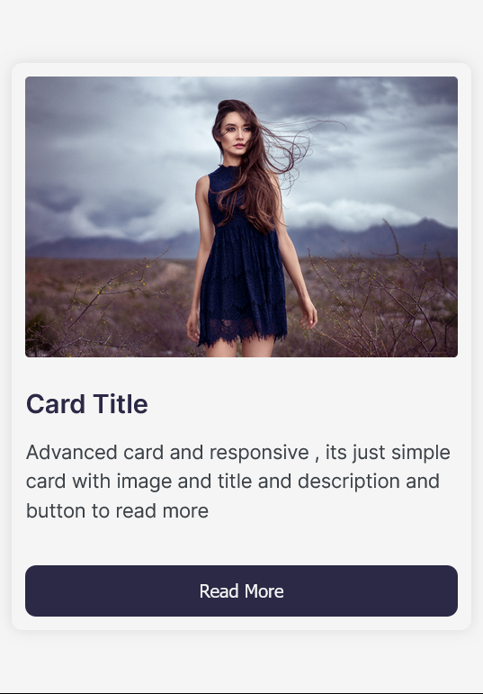

# Learn-HTML-CSS-Advanced-Concept

## in this repository i will learn HTML and CSS Advanced Concept like :
<ul style="list-style-type:disc">
  <li>HTML5</li>
  <li>CSS3</li>
  <li>Bootstrap</li>
  <li>Responsive Design</li>
  <li>Flexbox</li>
  <li>Sass</li>
  <li>Grid</li>
  <li>Animations</li>
  <li>Transitions</li>
  <li>Transforms</li>
  <li>And More</li>
</ul>
## i well make every 2 days a new project to learn new concept from zero to hero in HTML and CSS

## i well make a new folder for every project and i well put the link of the project in the README.md file

  first project is  nice responsive card 

  
  
  
  

and dont forget to follow me on my social media accounts and give me a star in this repository and share it with your friends to help me to make more projects and learn more concept in HTML and CSS

